# HA amb PostgreSQL

## Objectiu de la pràctica

En aquesta pràctica he muntat un entorn d'alta disponibilitat amb PostgreSQL utilitzant Docker, l'objectiu és entendre uns fitxers que ja venien configurats (`Dockerfile`, `patroni.yml`, `haproxy.cfg` i `docker-compose.yml`) i veure realment què feien. L'objectiu és muntar dos PostgreSQL, un principal i un altre de còpia, si el principal falla, l'altre ha d'agafar el seu lloc perquè la base de dades continuï funcionant, per controlar tot això fem servir Patroni, etcd i HAProxy i a més, he personalitzat les contrasenyes perquè no es facin servir les genèriques de l'enunciat.

## Preparació de l'entorn

He fet la pràctica a la màquina `asgbd-server-oc`, que és la màquina que he preparat per treballar aquesta activitat, aquesta màquina té dos interfícies de xarxa, una NAT per tenir Internet i una interfície interna. La IP interna que he fet servir és:

```text
192.168.1.111
```

Primer he comprovat que estava treballant a la màquina correcta i que tenia les IPs ben configurades:

```bash
hostname
ip -br a
```

També he comprovat que Docker i Docker Compose ja estaven instal·lats:

```bash
docker --version
docker compose version
```

Després he mirat si el port `5432` estava ocupat, al principi he vist que el port `5432` ja estava ocupat pel PostgreSQL local de la màquina, pero HAProxy també necessita publicar aquest port, si no ho hagués mirat, després Docker hauria fallat i segurament m'hauria liat buscant el problema en un altre lloc.

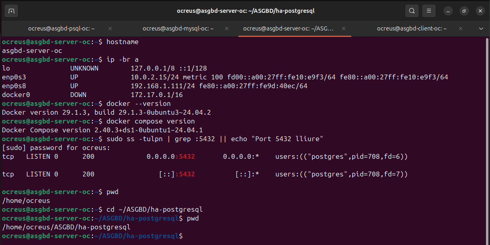

Aquesta captura es pot veure que estic a `asgbd-server-oc`, que la IP interna és `192.168.1.111`, que Docker està instal·lat i que el port `5432` estava ocupat pel servei `postgres`.

Per solucionar-ho he parat el PostgreSQL local:

```bash
sudo systemctl stop postgresql
```

Després he tornat a comprovar el port:

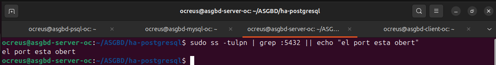

En aquesta captura es veu que ja no apareix cap servei escoltant pel port `5432`. El missatge que vaig posar diu “el port esta obert”, una manera de dir que el port esta lliure per poder-lo fer servir amb HAProxy.

## Creació dels fitxers de la pràctica

He treballat dins d'aquesta carpeta per treballar una mica ordenadament:

```bash
cd ~/ASGBD/ha-postgresql
```

Els fitxers principals de la pràctica són aquests:

```text
Dockerfile
docker-compose.yml
haproxy.cfg
patroni.yml
```

També un cop fets he comprovat que estiguessin creats amb:

```bash
ls -l
```

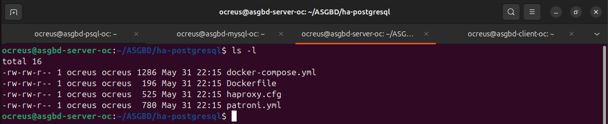

Podem veure els quatre fitxers principals de la pràctica, `docker compose` necessita trobar el fitxer `docker-compose.yml` dintre de la carpeta on estem treballant.

## Què fa cada fitxer

### Dockerfile

El `Dockerfile` parteix de la imatge `postgres:15-bullseye` i instal·la Patroni, `python3-etcd` i `curl`, patroni és el programa que controla quin PostgreSQL mana i quin queda com a còpia, si el principal cau, Patroni ajuda a canviar el líder. La part important és aquesta:

```Dockerfile
FROM postgres:15-bullseye

USER root

RUN apt-get update && \
    apt-get install -y patroni python3-etcd curl && \
    rm -rf /var/lib/apt/lists/*

USER postgres

CMD ["patroni", "/patroni.yml"]
```

Això fa que els contenidors `pg-1` i `pg-2` no siguin només PostgreSQL normal, sinó PostgreSQL controlat per Patroni.

### patroni.yml

El fitxer `patroni.yml` és el que configura Patroni, aquí es defineix el nom del clúster, la connexió amb etcd, la configuració de PostgreSQL i els usuaris, he canviat el nom del clúster a `asgbd_cluster_ha` per no deixar el nom genèric de l'exemple i deixar mes exacta el resultat. També he canviat les contrasenyes genèriques de l'enunciat, la part més important de Patroni és que permet saber quin node és el líder i quin node és la rèplica, també s'encarrega de promocionar una rèplica si el líder cau.

### haproxy.cfg

El fitxer `haproxy.cfg` configura HAProxy, aquest escolta pel port `5432`, que és el port normal de PostgreSQL, i també pel port `7000`, que és el panell web d'estadístiques. La part important és aquesta:

```ini
listen postgres
    bind *:5432
    option httpchk GET /primary
    http-check expect status 200
```

Això vol dir que HAProxy comprova quin node respon com a primari amb `/primary` idesprés envia les connexions PostgreSQL cap al node que toca.

### docker-compose.yml

El `docker-compose.yml` és el fitxer que aixeca tots els contenidors junts, els serveis que crea són:

```text
etcd
pg-1
pg-2
haproxy
```

`etcd` guarda l'estat del clúster. `pg-1` i `pg-2` són els dos nodes PostgreSQL amb Patroni i `haproxy` fa de punt d'entrada perquè no ens haguem de connectar directament a un node concret.

## Arrencada dels contenidors

Per aixecar tota la pràctica he fet servir:

```bash
sudo docker compose up -d --build
```

He fet servir `--build` perquè així Docker torna a generar la imatge a partir del `Dockerfile` i això va bé sobretot la primera vegada o si s'ha modificat algun fitxer, després he comprovat els contenidors amb:

```bash
sudo docker compose ps
```

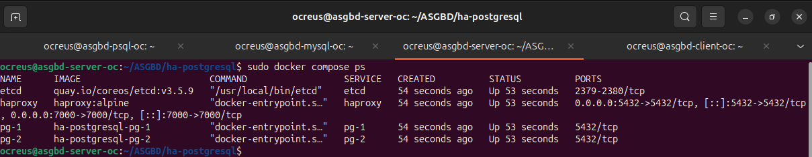

Aqui podem veure que els contenidors `etcd`, `haproxy`, `pg-1` i `pg-2` estan aixecats i també es veu que HAProxy publica els ports `5432` i `7000`.

## Comprovació del clúster amb Patroni

Per comprovar l'estat del clúster he fet servir aquesta comanda:

```bash
sudo docker exec -it pg-1 patronictl -c /patroni.yml list
```

El que fa es entrar al contenidor `pg-1` i executa `patronictl`, que és l'eina de Patroni per veure l'estat del clúster.

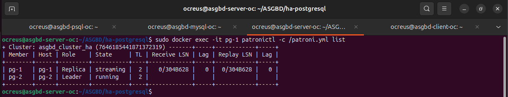

En aquesta captura es veu que el clúster es diu `asgbd_cluster_ha`. També es veu que `pg-2` és el `Leader` i que `pg-1` és la `Replica`. Això vol dir que Patroni està funcionant bé, perquè no tenim dos PostgreSQL independents, sinó un clúster amb un node principal i un node rèplica.

## Comprovació del panell de HAProxy

Després he comprovat el panell web de HAProxy des del navegador:

```text
http://192.168.1.111:7000
```

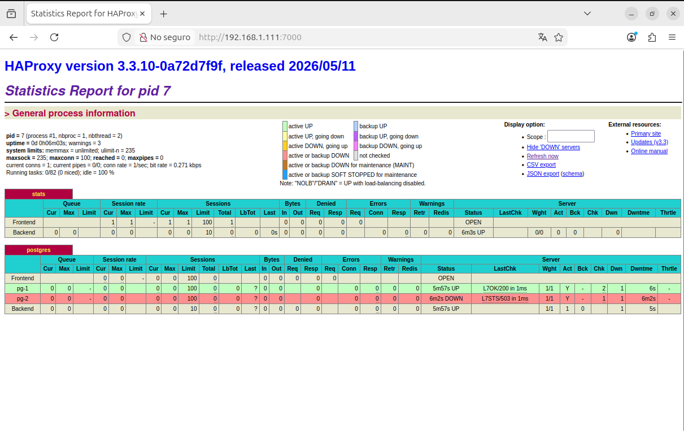

En aquesta captura es veu el panell d'estadístiques de HAProxy. Aquest panell serveix per veure l'estat dels nodes PostgreSQL. A mi m'ha ajudat entendre que HAProxy està configurat per comprovar quin node respon com a `/primary`, per això pot marcar un node com a disponible i l'altre com a no disponible per aquesta comprovació concreta. No vol dir sempre que el contenidor estigui apagat, sinó que per HAProxy només li interessa enviar canvis a la base de dades al node que actua com a primari.

## Connexió a PostgreSQL a través de HAProxy

Un cop HAProxy estava funcionant, he provat de connectar-me a PostgreSQL utilitzant la IP del servidor i el port `5432`.

```bash
psql -h 192.168.1.111 -p 5432 -U postgres -d postgres
```

Aquesta connexió no entra directament a `pg-1` o `pg-2`. entra per HAProxy, i HAProxy decideix cap a quin node enviar la connexió.

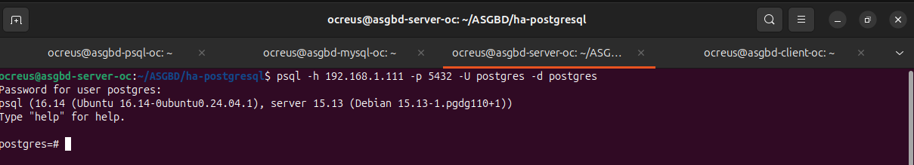

Es pot veure com he pogut entrar a PostgreSQL correctament amb `psql`.

## Creació d'una taula de prova

Per comprovar que la connexió no només entrava, sinó que també podia escriure dades, he creat una taula senzilla:

```sql
CREATE TABLE prova_ha (
    id SERIAL PRIMARY KEY,
    missatge VARCHAR(180),
    data_creacio TIMESTAMP DEFAULT NOW()
);
```

Després he inserit una fila:

```sql
INSERT INTO prova_ha (missatge)
VALUES ('prova alta disponibilitat');
```

I per ultim he consultat la taula:

```sql
SELECT * FROM prova_ha;
```

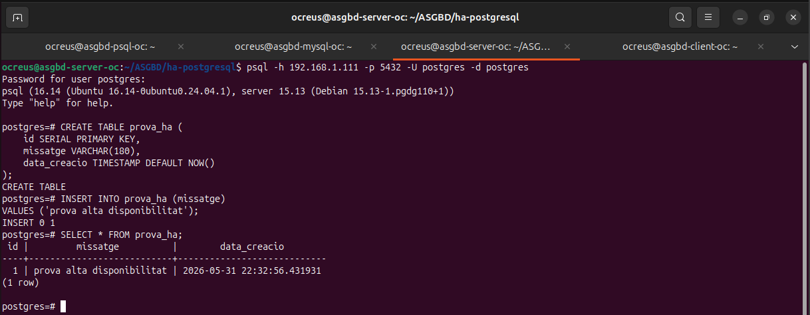

En aquesta captura es veu que la taula `prova_ha` s'ha creat bé i que hi ha una fila amb el missatge `prova alta disponibilitat`, això em serveix per comprovar que PostgreSQL està funcionant i que la connexió passant per HAProxy permet treballar amb la base de dades.

## Prova de failover

La part més important de la pràctica era comprovar què passava si el node líder queia, primer he mirat quin node era el líder. En aquest cas era `pg-2`, després he aturat el contenidor `pg-2`:

```bash
sudo docker stop pg-2
```

Com que `pg-2` era el líder, Patroni havia de promocionar `pg-1` com a nou líder, ho he comprovat amb:

```bash
sudo docker exec pg-1 patronictl -c /patroni.yml list
```

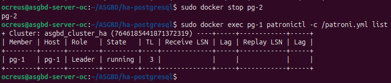

Després de parar `pg-2`, `pg-1` passa a ser el nou `Leader`.

Això és just el que buscava aquesta pràctica, que si cau el node principal, el sistema pugui continuar amb l'altre node.

## Consulta després del failover

Després d'aturar el líder, he tornat a consultar la taula passant per HAProxy:

```bash
psql -h 192.168.1.111 -p 5432 -U postgres -d postgres -c "SELECT * FROM prova_ha;"
```

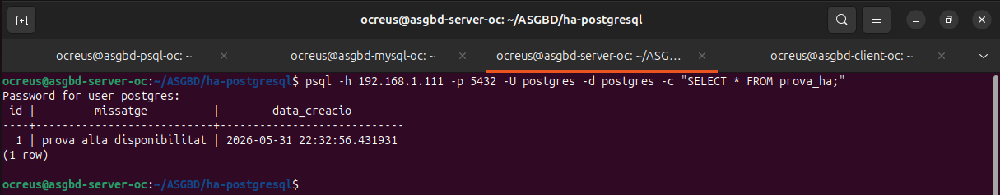

Podem veure que la taula `prova_ha` encara es pot consultar després del failover.

Això és important perquè demostra que el servei no ha quedat inutilitzat quan ha caigut `pg-2`. El client continua connectant-se a la mateixa IP i al mateix port, però ara HAProxy envia la connexió cap a `pg-1`.

## Recuperació del node pg-2

Després he tornat a arrencar el node que havia aturat:

```bash
sudo docker start pg-2
```

I he tornat a comprovar l'estat del clúster:

```bash
sudo docker exec pg-1 patronictl -c /patroni.yml list
```

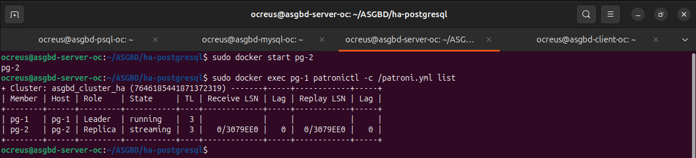

I `pg-1` continua sent el `Leader` i que `pg-2` torna al clúster com a `Replica` que és normal, quan recuperem el node que havia caigut, no torna automàticament a ser líder, sinó que torna com a rèplica i es posa a replicar des del líder actual.

## Problemes trobats durant la pràctica

El principal problema que he trobat ha sigut que el port `5432` ja estava ocupat pel PostgreSQL instal·lat directament a la màquina al principi, una tonteria pero un problema, perquè HAProxy també necessita publicar el port `5432` i ho he vist amb:

```bash
sudo ss -tulpn | grep :5432
```

La resposta donaba que el servei `postgres` estava escoltant al port `5432` i la solució ha sigut parar el PostgreSQL local:

```bash
sudo systemctl stop postgresql
```

Després d'això, Docker ha pogut aixecar HAProxy utilitzant el port `5432`.
